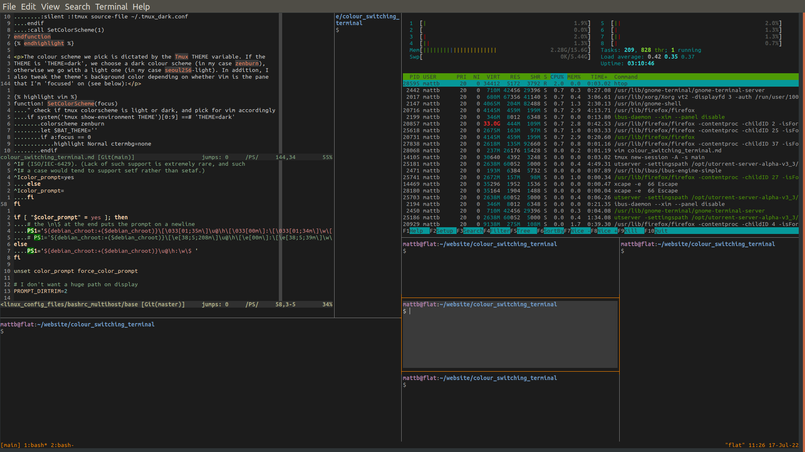
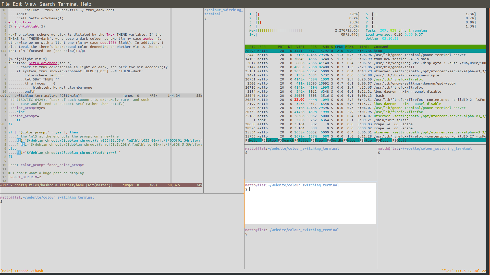
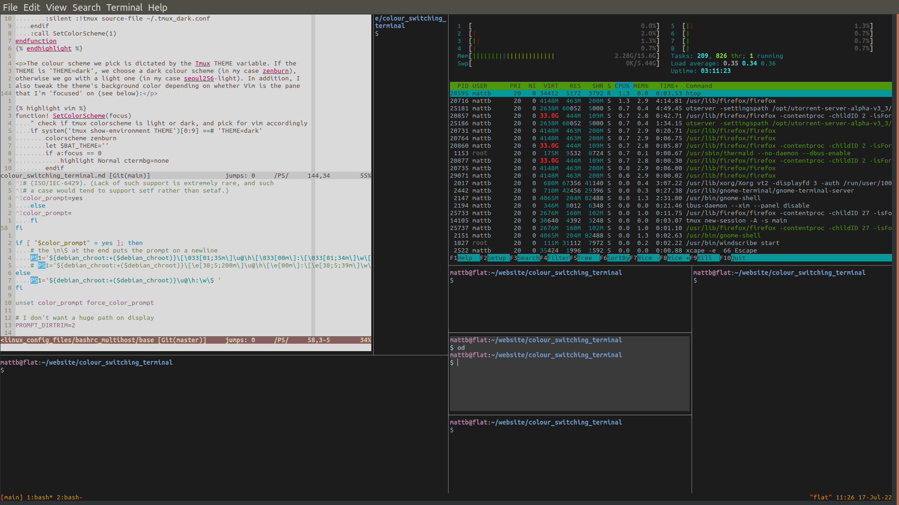

# Switch between light and dark mode in Vim and Tmux with one command 

I always have one of my monitors taken up with Vim and/or Tmux as I work,
and have up until now used dark themes. Here I implement a way to toggle
between a light and dark colour scheme for both Vim and Tmux in one go with a
simple shortcut (entered into either Vim or a Tmux pane).

In my case I can do either:

From a Tmux pane: 
<b>1a)</b> The alias 'ol' switches <b>both</b> Vim and Tmux to light mode. 
<b>1b)</b> The alias 'od' switches <b>both</b> Vim and Tmux to dark mode. 

From Vim: 
<b>2)</b> 'Leader-o' toggles <b>both</b> Vim and Tmux between light and dark colour
schemes.

The way it works is that I define a Tmux environmental variable that keeps
track of whether we have a light or dark colour scheme. Anytime I switch, be it
from Vim or a Tmux pane, the variable will be updated. Existing and new Tmux
panes and existing and new instances of Vim will check this variable and follow
the scheme.

## Code implementation
### Step 1: Switching colours from inside a Tmux pane

For the purpose of this guide, I'll assume my various dot files are in my
home directory. In reality I keep them all in a single git repository with
symbolic links from the home directory to allow me to keep my working
environment synchronised across machines as described on this <a
href="https://github.com/Matt-A-Bennett/linux_config_files">git repo</a>.

First, I've configured my ~/.bashrc such that it will automatically launch
Tmux and attempt to connect to a session called 'main', or create it if it
doesn't exist. I find this works for me, but you may want to alter this
step.

Once I've launched Tmux, I query the environment variable called 'THEME', if
it's not equal to 'THEME=light' (or just doesn't exist), then we go with the
dark theme. This means that when we first launch a Tmux session, we will
default to a dark theme:


if command -v tmux>/dev/null; then
    [[ ! $TERM =~ screen ]] && [ -z $TMUX ] && tmux new-session -A -s main

    # check if we have been switched to light, else go dark
    [[ ! $(tmux show-environment | grep THEME) =~ 'THEME=light' ]] && 
    tmux set-environment THEME dark
fi


At the beginning of my ~/tmux.conf file, I start by sourcing a secondary
Tmux file that contains the dark colours I've chosen. These values may get
overridden by a light scheme later:


# source colorscheme
set -g default-terminal 'screen-256color'
source-file ~/.tmux_dark.conf


These are the dark theme colours I have:


# dark colours
# fg = thin line
set -g pane-border-style "bg=colour234 fg=colour244"
set -g pane-active-border-style "bg=colour234 fg=colour208"
# fg = text
set -g window-style 'fg=colour248,bg=colour234'
set -g window-active-style 'fg=colour252,bg=colour235'
# Customize the status line
set -g status-fg colour208
set -g status-bg colour234


In addition to ~/.tmux_dark.conf, I have ~/.tmux_light.conf:


# light colours
# fg = thin line
set -g pane-border-style "bg=colour253 fg=colour244"
set -g pane-active-border-style "bg=colour253 fg=colour208"
# fg = text
set -g window-style 'fg=colour238,bg=colour253'
set -g window-active-style 'fg=colour238,bg=colour231'
# Customize the status line
set -g status-fg colour208
set -g status-bg colour253


If I'm in a Tmux pane, and want to switch colour schemes, I just source the
relevant file, and update the THEME variable. I have two aliases in my
~/.bashrc to do this. I remember them as ol for 'ON/Light', and od for
'OFF/Dark':


# switch between light and dark themes
alias ol="tmux source-file ~/.tmux_light.conf; tmux set-environment THEME 'light'"
alias od="tmux source-file ~/.tmux_dark.conf; tmux set-environment THEME 'dark'"


### Step 2: Switching colours from inside Vim

In my ~/.vimrc, I've defined two functions, one to set the colour scheme and
another to handle the reading and updating of the Tmux THEME variable. The
colour scheme we pick is dictated by the Tmux THEME variable, which we read
with a system call to Tmux. This returns the  THEME variable, as well as a
message saying 'Press ENTER or type a command to continue'. Obviously we're
only interested in the variable. If the variable indicates we should be dark,
we choose a dark colour scheme (in my case zenburn), otherwise we go with a
light one (in my case seoul256-light). Importantly, since I'm checking a match
with 'THEME=dark', we must take only the first 10 characters of message
returned by the system call:


function! SetColorScheme()
    " check if tmux colorsheme is light or dark, and pick for vim accordingly
    if system('tmux show-environment THEME')[0:9] == 'THEME=dark'
        colorscheme zenburn
    else
        colorscheme seoul256-light
    endif
endfunction


 Toggling the colour scheme between light and dark is done with a call to
another function. The function also re-sources the appropriate Tmux colour
scheme and updates the THEME variable. Once the THEME variable is updated, we
call the SetColorScheme function above to change Vim's colours:


function! Toggle_Light_Dark_Colorscheme()
    if system('tmux show-environment THEME')[0:9] == 'THEME=dark'
        :silent :!tmux source-file ~/.tmux_light.conf
        :silent :!tmux set-environment THEME 'light'
    else
        :silent :!tmux source-file ~/.tmux_dark.conf
        :silent :!tmux set-environment THEME 'dark'
    endif
    :call SetColorScheme()
endfunction


We can create a mapping (or a command) to quickly toggle the colour scheme
like so:


nnoremap <Leader>o :call Toggle_Light_Dark_Colorscheme()<cr>


When we open a new instance of Vim, the Tmux THEME variable will have
already been sent, and so we choose the colour scheme using the SetColorScheme
function (note that this must come after the SetColorScheme function in your
~/.vimrc):


call SetColorScheme()


We could stop there, but in the case where we have an instance of Vim
running, and change the scheme using one of our aliases from within in a Tmux
pane, Vim won't automatically re-run the SetColorScheme function:

We can use an autocmd to check and reset the colour scheme whenever Vim is
re-focused. Unfortunately, this doesn't work for Vim in the terminal, but
luckily there is a <a
href="https://github.com/tmux-plugins/vim-tmux-focus-events">plugin </a> that
resolves it for us:


Plugin 'tmux-plugins/vim-tmux-focus-events'


This plugin requires the following line in your ~/.tmux.conf (or that you've
installed the <a
href="https://github.com/tmux-plugins/tmux-sensible">tmux-sensible</a>
plugin):


set -g focus-events on


With one of the above options (I just have the line in my ~/.tmux.conf), we
can use the FocusGained event in ~/.vimrc:


autocmd FocusGained * :call SetColorScheme()


This will mean that as soon as you return to vim from the Tmux pane, Vim's
colour scheme will update automatically:

 

It would probably be easy to coerce Vim to constantly check the Tmux THEME
variable, but I only switch from light to dark in the evening (i.e. once a day)
so I don't want to make Vim do a million checks in the background for such a
rare event: 

One last remark is that I opted to change the colour of my command prompt to
be visible under both colour schemes. In my ~/.bashrc I put 35m to specify a
purple colour in bold font. How these numbers specify a colour is mysterious to
me, so I just googled around a bit:


PS1='${debian_chroot:+($debian_chroot)}\[\033[01;35m\]\u@\h\[\033[00m\]:\[\033[01;34m\]\w\[\033[00m\]\n\$ '


However, choosing colours in the ~/.tmux.conf file is easy with this code
which can be pasted into the terminal to display a colour grid of the 0-255
range:


for i in {0..255} ; do \
printf "\x1b[48;5;%sm%3d\e[0m " "$i" "$i"; \
if (( i == 15 )) || (( i > 15 )) && (( (i-15) % 6 == 0 )); then \
printf "\n"; \
fi; done


[back to home](../index.md)

---

