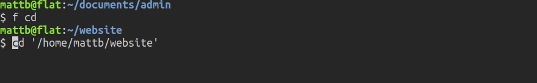

# Using FZF to select files for any program or command

The full code I've written so far can be found [here](./full_code.md).

I use <a href="https://github.com/junegunn/fzf">fzf</a> all the time in the
terminal. One very useful feature is to search for and select files to be
passed to some command (e.g. cat) or program (e.g. vlc). This is especially
useful when fzf is configured to always search a set of default directories
scattered around the file system, described in the previous post (coming
soon!).

Here I create a bash function to automate this procedure. The function is
called with the command or program as an argument. The function launches fzf,
you select your file(s) and hit enter. The selected files are passed to the
command/program. Apart from being a little easier to type than 'vlc $(fzf)',
the function returns control of the terminal to user (e.g. when opening GUIs).
The full command that was run will appear in your history just like any other:

Here we load a couple of python files, from two separate directories, and
neither of which is in the current working directory:

The command is found in our history in a way we could re-execute (note that
I wrapped the lines here so it would fit in the image, in reality the command
appears as a single line:

A really useful case is to change directory to somewhere far away in the
file system: 

Again, the command is found in our history in a way we could re-execute:

The usage is like this:
f cd (hit enter, choose path)
f cat (hit enter, choose files)
f vim (hit enter, choose files)
f vlc (hit enter, choose files

First we launch fzf with the possibility of selecting multiple items and
pass the 2nd argument to f(). This makes sense because the 1st argument to f()
is the command/program. Everything coming after that is what's being submitted
to fzf. The files that are selected are stored in a variable.



#!/bin/bash

f() {
    # Store the arguments from fzf
    IFS=$'\n' arguments=($(fzf --query="$2" --multi))

    # If no arguments passed (e.g. if Esc pressed), return to terminal
    if [ -z "${arguments}" ]; then
        return 1
    fi



The command typed into the terminal could for example be 'f vlc'. The
function will expand that into 'vlc file1.mp3 file2.mp3 &' and We want _that_
command to show up in our bash history, rather than just seeing 'f vlc'. So we
first write the shell's active history to the ~/.bash_history file, then later
we'll add this 'f vlc'vlc file1.mp3 file2.mp3 & command to the end of
~/.bash_history. Once we're all done, we'll load the ~/.bash_history file as
our active history.
 



history -w



In general, we want to launch programs as background jobs so that we can
still enter other commands into the terminal as they run. Non-GUI commands
such as 'vim', 'cat', 'head' etc should be run as foreground jobs. In these
cases, we can bring those jobs to the foreground later in the function. The one
exception I've found is the 'cd' command - this one no effect when run as
background, and doesn't show up as a job the can be brought to the foreground.
So we make sure not to add a '&' in this case.



if ! [[ $1 =~ ^(cd)$ ]]; then
    $1 "${arguments[@]}" &
else
    $1 "${arguments[@]}"
fi

if ! [[ $1 =~ ^(cd|zathura|evince|vlc|eog|kolourpaint)$ ]]; then
    fg %%
fi



Here we store the arguments passed to our program in a temporary file for
sanitising before being entered into ~/.bash_history. Then we use sed to put
all input arguments on one line and sanitise the command by putting single
quotes around all the arguments, also first put an extra single quote next to
any pre-existing single quotes in the raw argument (i.e. badly named files).
This has the effect that the quote in the argument itself is respected as
such.

If the program is on the list of GUI programs, we want to have the '&' on
the end of the command we find in our history. So append that to the sanitised
history command.



: > /tmp/fzf_tmp
for file in ${arguments[@]}; do
    echo $file >> /tmp/fzf_tmp
done

sed -i "s/'/''/g; s/.*/'&'/g; s/\n//g" /tmp/fzf_tmp

if [[ $1 =~ ^(zathura|evince|vlc|eog|kolourpaint)$ ]]; then
    sed -i '${s/$/ \&/}' /tmp/fzf_tmp
fi



Now we just load the sanitised command and append them to the
~/.bash_history, then reload the contents of the ~/.bash_history as our active
history. Finally, we can delete the we temporary file created.



arguments=$(cat /tmp/fzf_tmp)

echo ${1} ${arguments} >> ~/.bash_history

history -r

rm /tmp/fzf_tmp
}



The full code I've written so far can be found [here](./full_code.md).

[back to home](../README.md)
