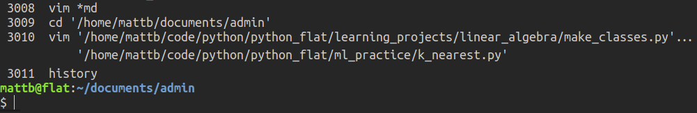
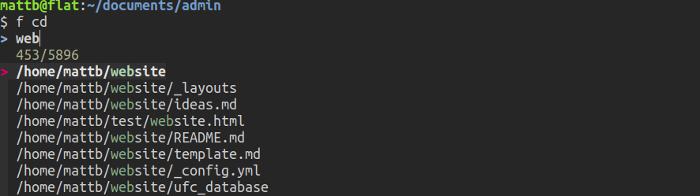

# Using FZF to select files for any program or command

The full code I've written so far can be found [here](./full_code.md).

I use <a href="https://github.com/junegunn/fzf">fzf</a> all the time in the
terminal. One very useful feature is to search for and select files to be
passed to some command (e.g. cat) or program (e.g. vlc). This is especially
useful when fzf is configured to always search a set of default directories
scattered around the file system, described in the <a
href="../fzf_search_dirs/fzf_search_dirs.html">previous post</a>.

## The Goal

Here I create a bash function to automate this procedure. The function is
called with the command or program as an argument. The function launches fzf,
you select your file(s) and hit enter. The selected files are passed to the
command/program. Apart from being a little easier to type than 'vlc $(fzf)',
the function returns control of the terminal to the user (e.g. when opening
GUIs). The full command that was run after expansion will appear in your
history just like any other.

Here we open a couple of python files in vim (the two marked with red
circles), from two separate directories, and neither of which is in the current
working directory. Note how few characters is needed to locate the files with
fzf:

The command is found in our history in a way we could re-execute (note that
I wrapped the lines here so it would fit in the image, in reality the command
appears as a single line:

A really useful case is to change directory to somewhere far away in the
file system: 

Again, the command is found in our history in a way we could re-execute:

The usage is like this: 
f cd [OPTION]... (hit enter, choose path) 
f cat [OPTION]... (hit enter, choose files) 
f vim [OPTION]... (hit enter, choose files) 
f vlc [OPTION]... (hit enter, choose files)

## The Code Implementation

The general method is to construct a command in ~/.bash_history taking the
form: program + options + arguments. We use fzf to supply the file names which
we'll use as arguments. Then we simply execute that command.

First we store the first argument as the program and shift it off the
argument list. Any remaining arguments are taken as options to the program,
which we pad with spaces. 



#!/bin/bash

f() {
    # Store the program
    program="$1"

    # Remove first argument off the list
    shift

    # Store any option flags with separating spaces
    options=" $@ "



We launch fzf with the possibility of selecting multiple items and
collect the arguments and store them in a variable:



# Store the arguments from fzf
arguments=$(fzf --multi)

# If no arguments passed (e.g. if Esc pressed), return to terminal
if [ -z "${arguments}" ]; then
    return 1
fi



The command typed into the terminal could for example be 'f vlc'. The
function will expand that into 'vlc file1.mp3 file2.mp3 &' and we want
<i>that</i> command to show up in our bash history, rather than just seeing 'f
vlc'. So we first write the shell's active history to the ~/.bash_history file,
then later we'll add this 'vlc file1.mp3 file2.mp3 &' command to the end of
~/.bash_history. Once we're all done, we'll load the ~/.bash_history file as
our active history.
 



history -w



Next we store the arguments passed to our program in a temporary variable
and sanitise them for entry into ~/.bash_history. Specifically, we use sed to
put all input arguments on one line wrap the command by single quotes each the
argument, also we put an extra single quote next to any pre-existing single
quotes in the raw argument (e.g. badly named files). This has the effect that
the quote in the argument itself is respected as such.



    for arg in "${arguments[@]}"; do
        arguments=$(echo "$arg" | sed "s/'/''/g; s/.*/'&'/g; s/\n//g")
    done



In general, we want to launch GUI programs as background jobs so that we can
still enter other commands into the terminal as they run. Non-GUI commands that
run in the terminal such as 'vim', 'cat', 'head' etc should be run as
foreground jobs (otherwise we won't see them). If the program is on the list of
GUI programs, we append '&' on the end of the command.
 



if [[ "$program" =~ ^(nautilus|zathura|evince|vlc|eog|kolourpaint)$ ]]; then
    arguments="$arguments &"
fi



Now we just append the sanitised commands to the ~/.bash_history, then
reload the contents of the ~/.bash_history as our active history.



echo $program$options$arguments >> ~/.bash_history

history -r



Finally, we execute the command that we placed in ~/.bash_history:



fc -s -1
}



The full code I've written so far can be found [here](./full_code.md).

[< Configuring FZF to search useful directories beyond the current working directory](../fzf_search_dirs/fzf_search_dirs.md)

[back to home](../index.md)

---

