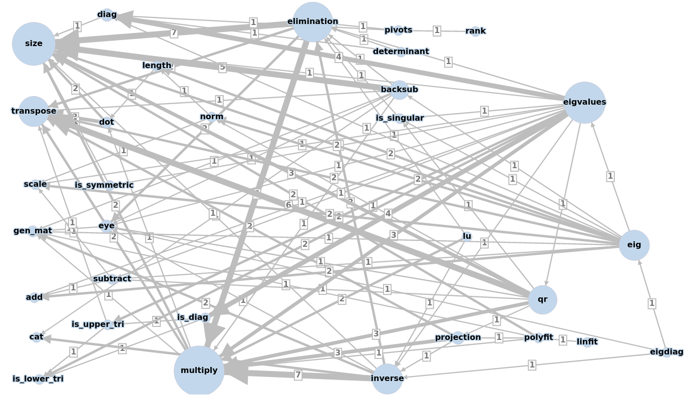

# Full Code
Below is all the code that we have written to date.

The dependencies among the methods are depicted by a weighted graph:

[back to project main page](./numpy_from_scratch.md)\
[back to home](../index.md)



import copy
from math import sqrt

def gen_mat(size, value=0):
    generated_mat = []
    for i in range(size[0]):
        generated_mat.append([value for j in range(size[1])])
    return Mat(generated_mat)

def eye(size):
    eye = gen_mat(size)
    for i in range(min(size)):
        eye.data[i][i] = 1
    return eye

def cat(A, B, axis=0):
    if axis == 0:
        concatenated = Mat(A.data + B.data)
    elif axis == 1:
        concatenated = Mat([rows[0]+rows[1] for rows in zip(A.data, B.data)])
    return concatenated

def print_mat(self, round_dp=99):
    A = copy.deepcopy(self)
    for row in A.data:
        rounded = [round(i,round_dp) for i in row]
        print(rounded)
    print()

def size(self):
    A = copy.deepcopy(self)
    return [len(A.data), len(A.data[0])]

class Mat:
    def __init__(self, data):
        self.data = data

    def transpose(self):
        A = copy.deepcopy(self)
        transposed = []
        for row_idx, row in enumerate(A.data):
            for col_idx, col in enumerate(row):
                # first time through, make new row for each old column
                if row_idx == 0:
                    transposed.append([col])
                else:
                    # append to newly created rows
                    transposed[col_idx].append(col)
            A.data = transposed
        return A

    def scale(self, scalar):
        A = copy.deepcopy(self)
        for row_idx, row in enumerate(A.data):
            for col_idx in range(len(row)):
                A.data[row_idx][col_idx] *= scalar
        return A

    def add(self, new_mat):
        A = copy.deepcopy(self)
        B = copy.deepcopy(new_mat)
        added_rows = []
        for rows in zip(A.data, B.data):
            added_cols = []
            for cols in zip(rows[0],rows[1]):
                added_cols.append(sum(list(cols)))
            added_rows.append(added_cols)
        A.data = added_rows
        return A

    def subtract(self, new_mat):
        A = copy.deepcopy(self)
        B = copy.deepcopy(new_mat)
        # reverse sign of second matrix
        B = B.scale(-1)
        # use add function
        A = A.add(B)
        return A

    def dot(self, new_mat):
        A = copy.deepcopy(self)
        B = copy.deepcopy(new_mat)
        # make both vectors rows with transpose
        if size(A)[0] != 1:
            A = A.transpose()
        if size(B)[0] != 1:
            B = B.transpose()
        # compute dot product
        dot_prod = []
        for cols in zip(A.data[0], B.data[0]):
            dot_prod.append(cols[0]*cols[1])
        dot_prod = sum(dot_prod)
        return dot_prod

    def length(self):
        A = copy.deepcopy(self)
        v_length = sqrt(A.dot(A))
        return v_length

    def norm(self):
        A = copy.deepcopy(self)
        A_norm = A.scale(1/A.length())
        return A_norm

    def multiply(self, new_mat):
        A = copy.deepcopy(self)
        B = copy.deepcopy(new_mat)
        # preallocate empty matrix
        multiplied = gen_mat([size(A)[0], size(B)[1]])
        # transpose one matrix, take a bunch of dot products
        B = B.transpose()
        for row_idx, row in enumerate(A.data):
            tmp_row = Mat([row])
            for col_idx, col in enumerate(B.data):
                # enter the dot product into our final matrix
                multiplied.data[row_idx][col_idx] = tmp_row.dot(Mat([col]))
        return multiplied

    def diag(self):
        A = copy.deepcopy(self)
        diag_vals = []
        for i in range(min(size(A))):
            diag_vals.append(A.data[i][i])
        return diag_vals

    def elimination(self):
        A = copy.deepcopy(self)
        # should do some row exchanges for numerical stability...

        # we assume the matrix is invertible
        singular = 0

        # create identity matrix which we'll turn into an E matrix
        tmpE = eye([size(A)[0], size(A)[1]])

        # create a permutation matrix for row exchanges
        tmpP = eye([size(A)[0], size(A)[0]])

        E = copy.deepcopy(tmpE)
        P = copy.deepcopy(tmpP)
        U = copy.deepcopy(A)
        pivot_count = 0
        row_exchange_count = 0
        for row_idx in range(size(U)[0]-1):
            for sub_row in range(row_idx+1, size(U)[0]):
                # create elimination mat
                nextE = copy.deepcopy(tmpE)
                nextP = copy.deepcopy(tmpP)

                # handle a zero in the pivot position
                if U.data[row_idx][pivot_count] == 0:
                    row_exchange_count += 1
                    # look for a non-zero value to use as the pivot
                    options = [row[pivot_count] for row in U.data[sub_row:]]
                    exchange = sub_row + options.index(max(options, key=abs))

                    # build and apply a purmutation matrix
                    nextP.data[row_idx][pivot_count] = 0
                    nextP.data[row_idx][exchange] = 1
                    nextP.data[exchange][exchange] = 0
                    nextP.data[exchange][pivot_count] = 1
                    U = nextP.multiply(U)
                    P = nextP.multiply(P)

                # check if the permutation avoided a zero in the pivot position
                if U.data[row_idx][row_idx] == 0:
                    singular = 1
                    # undo the row exchanges that failed
                    row_exchange_count -= 1
                    U = nextP.transpose().multiply(U)
                    P = nextP.transpose().multiply(P)
                    # move on to the next column
                    break

                # determine how much to subtract to create a zero
                ratio = U.data[sub_row][pivot_count]/U.data[row_idx][pivot_count]
                # create the elimination matrix for this step
                nextE.data[sub_row][row_idx] = -ratio
                # apply the elimination step to U
                U = nextE.multiply(U)
                # update the overall E
                E = nextE.multiply(E)
            pivot_count += 1

        # If A was a 1x1 matrix, the above loops didn't happen. Take the
        # reciprocal of the number:
        if size(U)[0] == 1 and size(U)[1] == 2:
            if U.data[0][0] != 0:
                U.data[0] = [1/U.data[0][0], 1]
            row_idx = -1

        # check if the permutation avoided a zero in the pivot position
        if U.data[row_idx+1][row_idx+1] == 0:
            singular = 1

        return P, E, A, U, singular, row_exchange_count

    def backsub(self, b):
        A = copy.deepcopy(self)
        b = copy.deepcopy(b)
        augmented = cat(A, b, axis=1)
        _, _, _, U, _, _ = augmented.elimination()
        coeff = []
        for idx in range(-1, -(size(U)[0]+1), -1):
            if idx < -1:
                E = eye([size(U)[0]+1, size(U)[1]])
                E.data[idx][size(U)[1]-1] = -1*(coeff[-1])
                U = U.multiply(E)
            row = U.data[idx]
            # check solution possibilities
            if row[idx-1] == 0 and row[-1] != 0:
               print('No solution!')
               return None
            elif row[idx-1] == 0 and row[-1] == 0:
               print('Infinite solutions!')
               coeff.append(1)
            else:
                coeff.append(row[-1]/row[idx-1])
        coeffs = list(reversed(coeff))
        return Mat([coeffs]).transpose()

    def pivots(self):
        A = copy.deepcopy(self)
        # find U
        _, _, _, U, _, _ = A.elimination()
        # extract the non-zeros on the diagonal
        diag_vals = U.diag()
        pivot_info = [(i, val) for i, val in enumerate(diag_vals) if val]
        return pivot_info

    def rank(self):
        A = copy.deepcopy(self)
        return len(A.pivots())

    def is_singular(self):
        A = copy.deepcopy(self)
        _, _, _, _, singular, _ = A.elimination()
        return singular

    def determinant(self):
        A = copy.deepcopy(self)
        # find U
        _, _, _, U, _, row_exchange_count = A.elimination()
        # muliply the pivots
        det = 1
        diag_vals = U.diag()
        for val in diag_vals:
            det *= val
        # if an odd number of row exchanges, multiply determinant by minus one
        if row_exchange_count % 2:
            det *= -1
        return det

    def inverse(self):
        A = copy.deepcopy(self)
        mat_size = size(A)

        # create [A I]
        I = eye(mat_size)
        augmented = cat(A, I, axis=1)

        # perform elimination to get to [U ~inv]
        _, _, _, U, singular, _ = augmented.elimination()

        if singular:
            print('Matrix is singular!')
            return None

        # seperate augmented into U and ~inv
        tmp_fU = Mat([Urow[0:mat_size[1]] for Urow in U.data])
        tmp_inv = Mat([Urow[mat_size[1]:] for Urow in U.data])

        # creae anti-diag I
        antiI = gen_mat(mat_size)
        for i, j in enumerate(reversed(range(mat_size[1]))):
            antiI.data[i][j] = 1

        # multiply U and ~inv on both sides by anti-diag I
        fU = antiI.multiply(tmp_fU).multiply(antiI)
        f_tmp_inv = antiI.multiply(tmp_inv).multiply(antiI)

        # put fU back into [fU  f~inv]
        augmented = cat(fU, f_tmp_inv, axis=1)

        # perform elimination again to get to [cI cA^-1]
        _, _, _, U, _, _ = augmented.elimination()

        # divide each row by c to get [I A^-1]
        div = gen_mat(mat_size)
        for i in range(mat_size[0]):
            div.data[i][i] = 1/U.data[i][i]
        inv = div.multiply(U)

        # flip back
        inv = antiI.multiply(inv)
        for i in range(mat_size[1]):
            inv.data[i] = inv.data[i][mat_size[1]:]
        inv = inv.multiply(antiI)

        return inv

    def lu(self):
        A = copy.deepcopy(self)
        P, E, A, U, _, _ = A.elimination()
        E = P.multiply(E)
        L = P.multiply(E.inverse())
        return A, P, L, U

    def projection(self):
        # P = A((A'A)^-1)A'
        A = copy.deepcopy(self)
        AtAinv = (A.transpose().multiply(A)).inverse()
        for_x = AtAinv.multiply(A.transpose())
        Projection = A.multiply(for_x)
        return Projection, for_x

    def polyfit(self, order=1):
        b = copy.deepcopy(self)
        # create a model
        A = gen_mat([size(b)[0], 1])
        for i in range(size(b)[0]):
            orders = []
            for exponent in range(order+1):
                orders.append(i**exponent)
            A.data[i] = orders
        # fit model to b
        _, for_x = A.projection()
        fit = for_x.multiply(b)
        return fit

    def linfit(self):
        return self.polyfit()

    def qr(self):
            A = copy.deepcopy(self)

            if A.is_singular():
                print('Matrix is singular!')
                return A, None, None

            A = A.transpose()
            Q = copy.deepcopy(A)
            I = eye(size(A))
            # projection orthogonal to column
            for col in range(size(Q)[0]-1):
                Col = copy.deepcopy(Mat([Q.data[col]]))
                P, _ = Col.transpose().projection()
                P = I.subtract(P)
                # project and put into matrix Q
                for col2 in range(col+1, size(Q)[0]):
                    Col = copy.deepcopy(Mat([Q.data[col2]]))
                    q = P.multiply(Col.transpose()).transpose()
                    Q.data[col2] = q.data[0]

                # normalise to unit length
                for x, q in enumerate(Q.data):
                    q = Mat([q])
                    q = q.norm()
                    Q.data[x] = q.data[0]

            A = A.transpose()
            R = Q.multiply(A)
            Q = Q.transpose()
            A = Q.multiply(R)

            return A, Q, R

    def eig(self, epsilon = 0.0001):
        A = copy.deepcopy(self)
        old_eigs = [0 for _ in range(size(A)[0])]
        old_eigs = Mat([old_eigs])
        for its in range(100):
            _, Q, R = A.qr()
            QT = Q.transpose()
            QTA = QT.multiply(A)
            QTAQ = QTA.multiply(Q)
            A = QTAQ

            eigs = Mat([A.diag()])
            diffs = old_eigs.subtract(eigs)
            diffs = [abs(i) for i in diffs.data[0]]
            if sum(diffs) < epsilon:
                return A.diag()
            old_eigs = eigs
        else:
            print('Did not converge!')
            return None



[back to project main page](./numpy_from_scratch.md)\
[back to home](../index.md)

---

