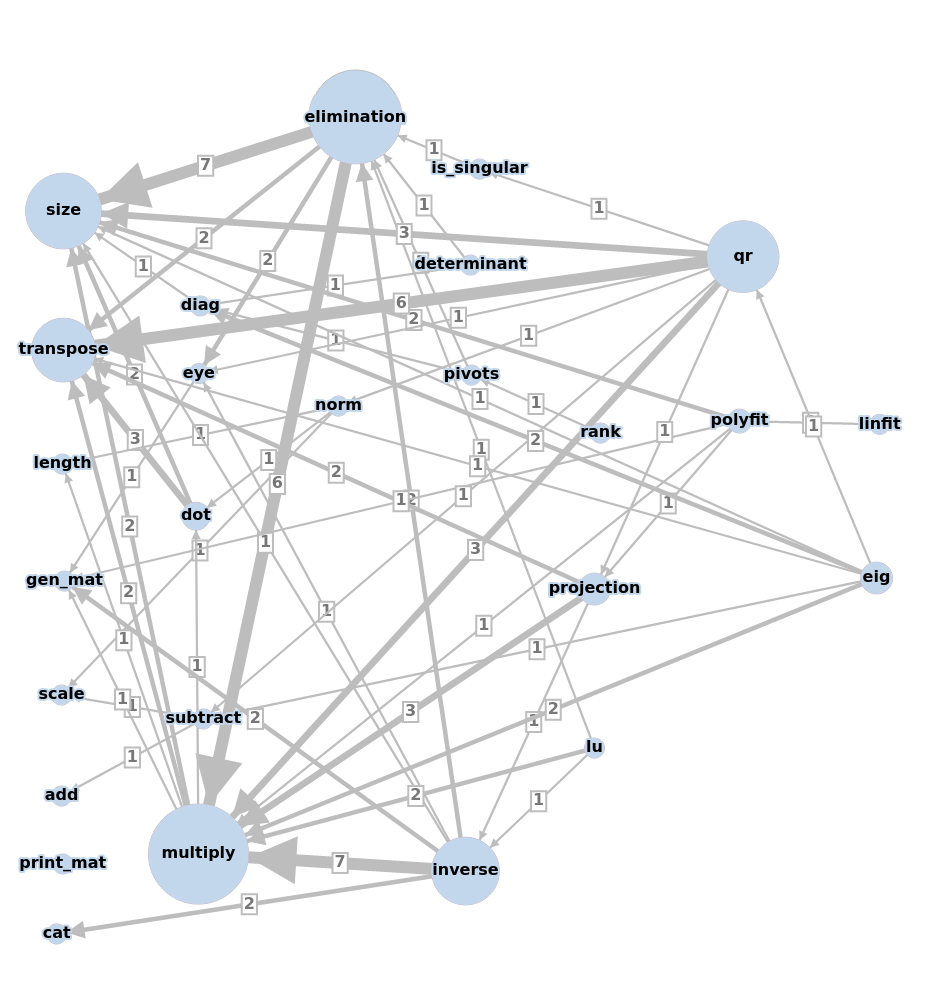

# Building a Python 3 Numpy-like library from scratch

The full code I've written so far can be found [here](./full_code.md).

Also see my related project: [Adding a statistics sub-package](../stats_from_scratch/stats_from_scratch.md)

I want to improve my knowledge of classes, objects, functions and methods in
Python 3 and to gain a better understanding of the 'standard practices'
associated with writing them. So I've decided to try and build a Python library
that allows me to do linear algebra operations - something like the popular
Numpy module, but of course much smaller in scope. As a bonus, it will allow me
to consolidate my recent studies of linear algebra. I will attempt to implement
all the linear algebra operations, methods and algorithms covered in Gilbert
Strang's Introduction to linear algebra. As much as possible, I will use
Python's standard library. N.B. I do use copy.deepcopy (imported as dc) in a
few places to avoid side effects (altering mutable objects passed as
arguments).

## Class, methods and functions to implement

Below is a list of the topics I've covered in my studies so far, and which I
will attempt to realise in my library.

### Class, standalone functions and miscellaneous methods 
- [Mat(rix) Class](./class_and_standalone_functions_1.md)
- [Printing matrices](./class_and_standalone_functions_1.md#printing-matrices)
- [Generate matrices](./class_and_standalone_functions_1.md#generate-matrices)
- [Indexing a matrix](./class_and_standalone_functions_1.md#indexing-a-matrix)
- [Transpose](./class_and_standalone_functions_1.md#transpose-of-a-matrix)
- [Size of a matrix](./class_and_standalone_functions_2.md#size-of-a-matrix)
- [Is matrix square?](./class_and_standalone_functions_2.md#is-matrix-square)
- [Is matrix wide?](./class_and_standalone_functions_2.md#is-matrix-wide-or-tall)
- [Is matrix tall?](./class_and_standalone_functions_2.md#is-matrix-wide-or-tall)
- [Is matrix triangular?](./class_and_standalone_functions_2.md#is-matrix-lower-triangular)
- [Is matrix diagonal?](./class_and_standalone_functions_2.md#is-matrix-diagonal)
- [Is matrix symmetric?](./class_and_standalone_functions_2.md#is-matrix-symmetric)
- [Combining matrices](./class_and_standalone_functions_3.md#combining-matrices)
- [Tiling matrices](./class_and_standalone_functions_3.md#tiling-matrices)
- [Get the diagonal of a matrix](./class_and_standalone_functions_3.md#get-the-diagonal-of-a-matrix)

### Fundamental methods
- [Element-wise functions of one or more matrices](./elwise_function.md)
- [Addition and subtraction](./elwise_function.md#addition-and-subtraction)
- [Element-wise multiplication/division and scalar multiplication](./elwise_function.md#elementwise-multiplicationdivision-and-scalar-multiplication)
- [Dot Product](./dot_prod_length_and_mat_multiply.md)
- [Length](./dot_prod_length_and_mat_multiply.md#length)
- [Norm](./dot_prod_length_and_mat_multiply.md#norm)
- [Matrix Multiplication](./dot_prod_length_and_mat_multiply.md#matrix-multiplication)

### Secondary methods 
- [$EA = U$](./elimination.md)
- [Back substitution](./backsub.md)
- [Pivots, rank, singularity, determinant, positive definiteness](./rank_piv_sing_det.md)
- [Inverse](./inverse.md)
- [$A = LU$](./lu_factorisation.md)
- [Projection and regression](./projection_and_regression.md)
- [$A = QR$](./qr_factorisation.md)
- [Eigenvalues and eigenvectors](./eigen.md)
- [Diagonalisation: $A = X\Lambda X^{-1}$](./diagonalisation.md)

### Dependencies between methods

The dependencies among the above methods are depicted by a weighted graph:

[back to home](../index.md)

---

