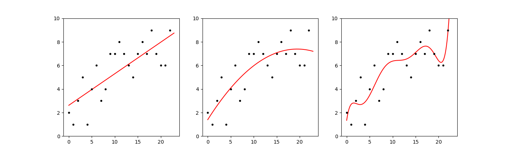

# Projection and regression

Often there is no solution to $Ax = b$. Usually in practical applications we
have a large set of data points $b$ that we want to fit with a model - the
columns of $A$ - with only a few parameters - stored in $x$ - much fewer
parameters than we have data points. Our model matrix $A$ is tall and thin, and
so has no inverse! $x = A^{-1}b$ is not an option to find the parameters in
$x$.

The data points contain some measurement error or 'noise' and we don't want
our model to fit this noise. We want our model to capture informative trends,
that will generalise to new data with different noise. Therefore we have to
accept some discrepancy between our fitted model and the data. We want to
minimise this 'model error' when we fit.

Since we can't find an $x$ that satisfies $Ax = b$, we look for a 'best $x$'
that comes close: \(\hat x\). The $b$ doesn't fall into the column space of $A$
(henceforth $C(A)$) whereas \(A\hat x\) does, so we project $b$ to the closest
point in $C(A)$. This implies that the 'error' is the shortest vector $e$
needed to 'bridge the gap' from $b$ to $C(A)$:

$$
e = b - A\hat x
$$

The vector $e$ is perpendicular to $C(A)$ and so is in the nullspace of
$A^T$ (henceforth $N(A^T)$):

$$
A^T(b - A\hat x) = 0
$$

The equation can be expanded to:

$$
A^Tb - A^TA\hat x = 0
$$

Rearranging::

$$
A^TA\hat x = A^Tb
$$

Therefore, our best estimate of the parameters of the model is:

$$
\hat x = (A^TA)^{-1}A^Tb
$$

And the vector that will be in the $C(A)$ (that is the 'predicted values' of
our model) is:

$$
A\hat x = A(A^TA)^{-1}A^Tb
$$

Thus we arrive at a matrix to 'project' some vector into $C(A)$:

$$
P = A(A^TA)^{-1}A^T
$$

## Code implementation

We define two methods, one that gives both the general projection matrix $P$
and the matrix that multiplies $b$ to give \(\hat x\):



def projection(self):
    # P = A((A'A)^-1)A'
    AtA_inv = (self.transpose().multiply(self)).inverse()
    for_x = AtA_inv.multiply(self.transpose())
    Projection = self.multiply(for_x)
    return Projection, for_x



The second method gives the parameters for an nth degree polynomial curve
through a set of data points in $b$. To do so, we create a matrix $A$ with as
many rows as $b$ and one column per term of the polynomial - the 1st column is
all ones, and is the basis for the intercept ($x^0 = 1$); The second
incrementally increases and forms the basis for the slope ($x^1 = x$); The
third column is for the squared terms ($x^2 = x^2$) and so on:



def polyfit(self, order=1):
    # create a model
    A = gen_mat([size(b)[0], 1])
    for i in range(size(b)[0]):
        orders = []
        for exponent in range(order+1):
            orders.append(i**exponent)
        A.data[i] = orders
    # fit model to b
    _, for_x = A.projection()
    fit = for_x.multiply(b)
    return fit



Then we define a method to fit a straight line. This is the default of the
polyfit method, but fitting a straight line is so common that it's nice to have
a more descriptive method to call:



def linfit(self):
    return self.polyfit()



## Demo

Below, we define a helper function and try this method out on a small
sample. We fit a straight line, a 2nd degree polynomial, and a 7th degree
polynomial:


import linalg as la

# regression
def quick_plot(b, orders=[1]):
    fig = plt.figure()
    Xs = [i/10 for i in range(len(b.data[0])*10)]
    for idx, order in enumerate(orders):
        fit = b.transpose().polyfit(order=order)
        Ys = []
        for x in Xs:
            y = 0
            for exponent in range(order+1):
                y += fit.data[exponent][0]*x**exponent
            Ys.append(y)

        ax = plt.subplot(1,len(orders),idx+1)
        d = ax.plot(Xs[0::10], b.data[0], '.k')
        f = ax.plot(Xs, Ys, '-r')
        ax.set_ylim([0, max(b.data[0])+1])
    return fig

import matplotlib.pyplot as plt
b = la.Mat([[2,1,3,5,1,4,6,3,4,7,7,8,7,6,5,7,8,7,9,7,6,6,9]])

fig = quick_plot(b, orders=[1, 2, 7])
plt.show()



[< A = LU](./lu_factorisation.md)

<a href="https://matt-a-bennett.github.io/numpy_from_scratch/qr_factorisation.html">A = QR ></a>

[back to project main page](./numpy_from_scratch.md)\
[back to home](../index.md)

---

