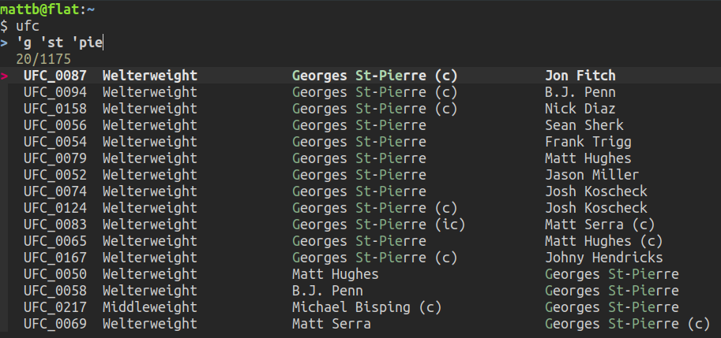
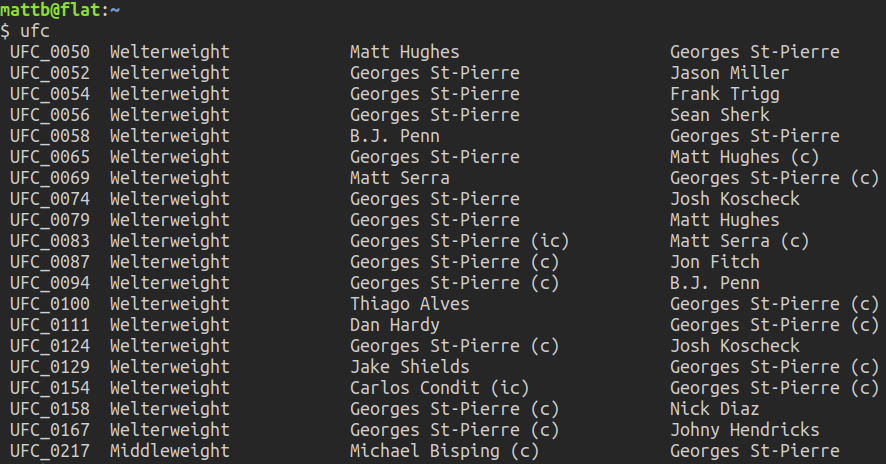

# Creating a searchable database of UFC contests using web-scraping in Python 3

The full code I've written so far can be found [here](./full_code.md).

## The Goal

I'm a fan of the UFC, and often I want to watch an old fight of a particular
fighter but I don't remember all their previous opponents or which UFC events
they performed in.

I decided to create a simple database containing a row for each fight in
each UFC event, the weight category and fighter names. Then I can simply pipe
the file contents into fzf and I have an interactive searcher which quickly
shows me all the UFC cards on which that fighter had fought and who their
opponent was.

With the following alias in my .bashrc file:



alias ufc='cat ~/ufc/ufc_database.txt | fzf | sort'



I can easily whittle down the results to a specific fighter:

The selected results are sorted and sent to STDOUT:

## The Plan

Wikipedia has a <a href="https://en.wikipedia.org/wiki/List_of_UFC_events">page
listing all UFC events</a> and features a table containing links to a page
about each event. On these individual event pages there is a table containing
information I want. So what I want is to have a python script that can go to
the list of event page, follow up each link to individual event pages, and pull
the correct table.

We'll get the link urls using BeautifulSoup. Handily, there is a dedicated
module just for accessing the html for of any Wikipedia page. Once we have the
html, we can use the pandas module to read the table of interest into a
dataframe object. Then it's a matter of cleaning the data and entering it into
the database. The goal is the following txt file (containing 1175 fights):



 Event     Weight                  Fighter1                        Fighter2                       
 UFC_0020  Heavyweight             Bas Rutten                      Kevin Randleman                
 UFC_0020  Heavyweight             Pedro Rizzo                     Tra Telligman                  
 UFC_0020  Heavyweight             Pete Williams                   Travis Fulton                  
    .          .                        .                               .
    .          .                        .                               .
    .          .                        .                               .



## The Code Implementation

After importing the modules we initialise a table:



from bs4 import BeautifulSoup as bs
import requests
import re
import pandas as pd
import wikipedia as wp
from prettytable import PrettyTable
import random

# initialise a table object with column names
t = PrettyTable(['Event', 'Weight', 'Fighter1', 'Fighter2'])
t.align='l'
t.border=False



Next we send an http request to get the list of events webpage using the
requests module and then scrape the content with BeautifulSoup:



# grab all the links on the List_of_UFC_events wiki page
res = requests.get("https://en.wikipedia.org/wiki/List_of_UFC_events")
soup = bs(res.text, "html.parser")



The main body of the script is a loop where we scan through each link on the
list of events page and determine if it is a link to an individual UFC event.
This is done with a simple regular expression whereby we search each link for
the string 'UFC_' followed by some number of digits. There can be more than one
link to the same page, and so we make sure not to retry the same link twice. If
we find the string, and we've not yet tried the link we check if the event is
later than existing entries in the database ('latest') and that it's not a
future scheduled event ('future'). I that's the case we go ahead and read the
page html and pull the 3rd table, which contains the information we want, into
a pandas dataframe:



# latest event already in the database will not be pulled in again
latest = 255
# future events will not be pulled in either
future = 259

# avoid visiting the same page more that once
tried = []
with open("~/videos/ufc/ufc_database.txt", "a") as f:
    for link in soup.find_all("a"):
        try:
            url = link.get("href", "")
            # if the link looks like a ufc event that we've not tried yet
            if bool(re.search('UFC_\d+$', url)) and (url not in tried):
                tried.append(url)
                # get the even number
                event = int(re.findall('\d+$', url)[0])
                if event > latest and event < future:

                    print(url)

                    # read the page
                    html = wp.page(url[6:], auto_suggest=False).html().encode("UTF-8")
                    # pull 3rd table
                    df = pd.read_html(html)[2]



Next we put a zero padded UFC event number - this will allow us to sort the
database chronologically when we're done. After re-indexing the dataframe we
extract the data we want and label the columns.

Then we extract the section of the table that lists fights that appeared on the
main card (skipping the preliminary fights) and convert data to comma
separated string:



# put the zero padded ufc number as the Event column
df.insert(0, "Event", ('UFC_' + url[10:].zfill(4)))
# get rid of columns I don't want (brittle approach...)
df = df.drop(df.columns[[3,5,6,7,8]], axis=1)
# change df from a multiindex to single indexed object
df.columns = df.columns.get_level_values(0)
# rename the colums sensibly
df.columns = ['Event', 'Weight', 'Fighter1', 'Fighter2']
# find where the prelims start
index = df[df['Weight'].str.contains('Preliminary')].index[0].item()
# select only the main card
df = df[:index]
# strip the indices and column names and convert to csv string
data = df.to_csv(index=False, header=False)
# each line is a list item contatining a csv string
data = data.splitlines()



If I don't remember the winner of a fight, I would rather not have that spoiler
before I re-watch it. And since the tables on Wikipedia invariably list the
victor followed by the loser, I shuffle the order for my database: 


# shuffle order of fighters (the winner is always listed first)
for line in data:
    entries = line.split(',')
    copy = entries[2:]
    random.shuffle(copy)
    entries[2:] = copy
    # add each csv to a column which is nicely aligned
    t.add_row(entries)



I noticed that a couple of links give me an error, so in those cases we just
move on to the next link. If we are just adding in some recent events to an
existing database, then we remove the header from the table since we already
have that. Then we sort the list by the event number and write the data to a
txt file:



    # just move on from any errors
    except:
        print('error')
        pass

# if we're just adding to an existing database, the header already exists
if latest > 0:
    t.header = False

# sort into chronological order and save
f.write(str(t.get_string(sortby=('Event'))))



The full code I've written so far can be found [here](./full_code.md)

[back to home](../index.md)

---

